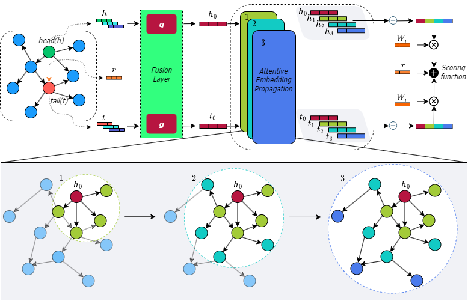

# LiteralKG
LiteralKG, a novel Knowledge Graph Embedding Model, is specialised in fusing different types of Literal information and entity relations into unified representations, which benefit companion animal disease prediction.
LiteralKG is developed by [NS Lab, CUK](https://nslab-cuk.github.io/) based on pure [PyTorch](https://github.com/pytorch/pytorch) backend. The paper is available on [arXiv](https://arxiv.org/abs/2308.09517). 

<p align=center>
  <a href="https://www.python.org/downloads/release/python-360/">
    =3.6-3776AB?logo=python&style=flat-square" alt="Python">
  </a>    
  <a href="https://github.com/pytorch/pytorch">
    =1.4-FF6F00?logo=pytorch&style=flat-square" alt="pytorch">
  </a>       
  
  
  
  
  
  
  
</p>

<be>

## 1. Overview

Over the past few years, Knowledge graph (KG) embedding has been used to benefit the diagnosis of animal diseases by analyzing electronic medical records (EMRs), such as notes and veterinary records. However, learning representations to capture entities and relations with literal information in KGs is challenging as the KGs show heterogeneous properties and various types of literal information. Meanwhile, the existing methods mostly aim to preserve graph structures surrounding target nodes without considering different types of literals, which could also carry significant information. We propose  **LiteralKG**, a knowledge graph embedding model for the efficient diagnosis of animal diseases, which could learn various types of literal information and graph structure and fuse them into unified representations. We construct a knowledge graph that is built from EMRs along with literal information collected from various animal hospitals. We then fuse different types of entities and node feature information into unified vector representations through gate networks. Finally, we propose a self-supervised learning task to learn graph structure in pretext tasks and then towards various downstream tasks. Experimental results on link prediction tasks demonstrate that our model outperforms the baselines that consist of state-of-the-art models.


<br>

<p align="center">
  
  <br>
  <b></b> The overall architecture of LiteralKG.
</p>

## 2. Reproducibility

### Setup environment for running:

- Running: `python -m venv LiteralKG`

#### Connect to the environment:

- On window OS run: `env.bat`
- On linux OS or MAC OS run: `source image/bin/activate`

#### Install pip packages:

`pip install -r requirements.txt`

#### To build model:

- Running `python index.py`


## 3. Reference

:page_with_curl: Paper [on arXiv](https://arxiv.org/): 
* [](https://arxiv.org/abs/2308.09517) 

:chart_with_upwards_trend: Experimental results [on Papers With Code](https://paperswithcode.com/): 
* [](https://paperswithcode.com/paper/transitivity-preserving-graph-representation)

:pencil: Blog [on Network Science Lab](https://nslab-cuk.github.io/2023/08/17/UGT/): 
* [](https://nslab-cuk.github.io/2023/08/17/UGT/)


## 4. Citing LiteralKG

Please cite our [paper](https://arxiv.org/abs/2308.09517) if you find *Literal* useful in your work:
```
@misc{hoang2023ugt,
      title={Transitivity-Preserving Graph Representation Learning for Bridging Local Connectivity and Role-based Similarity}, 
      author={Van Thuy Hoang and O-Joun Lee},
      year={2023},
      eprint={2308.09517},
      archivePrefix={arXiv},
      primaryClass={cs.LG}
}
```

## 5. Contributors

<a href="https://github.com/NSLab-CUK/LiteralKG/graphs/contributors">
  
</a>


<br>

***

<a href="https://nslab-cuk.github.io/"></a>

***
